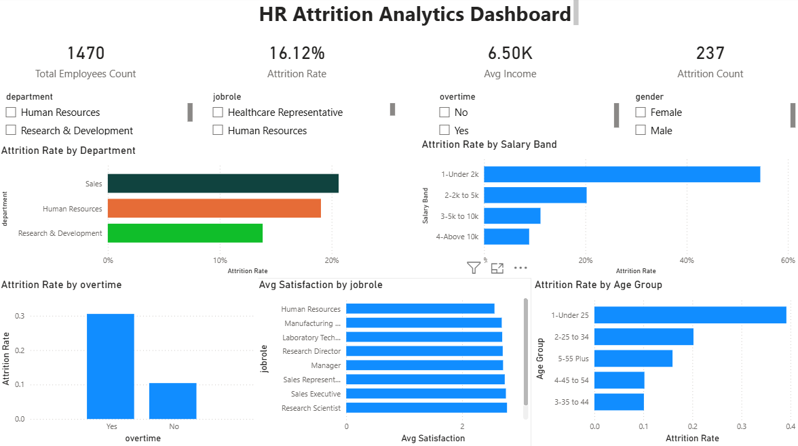

# HR Attrition Analytics Dashboard


---

## Project Overview

Analyzed **1,470 employee records** from the IBM HR Employee Attrition dataset to identify the key drivers of employee turnover across departments, salary bands, job roles, and age groups.

The project combines **PostgreSQL** for structured SQL analysis and **Power BI** for an interactive dashboard — designed to give HR teams actionable, data-driven insights to reduce attrition.

---

## Tools Used

| Tool | Purpose |
|------|---------|
| PostgreSQL | Data storage, SQL querying, business analysis |
| Power BI | Interactive dashboard and KPI visualization |
| DAX | Calculated measures and columns in Power BI |
| GitHub | Version control and project showcase |

---

## Dataset

- **Source:** IBM HR Analytics Employee Attrition Dataset (Kaggle)
- **File:** `WA_Fn-UseC_-HR-Employee-Attrition.csv`
- **Records:** 1,470 employees
- **Columns:** 33 variables including Age, Department, JobRole, MonthlyIncome, Attrition, JobSatisfaction, OverTime, YearsAtCompany

---

## Business Questions Answered

1. What is the overall attrition rate in the company?
2. Which department has the highest attrition rate?
3. What is the average monthly income of employees who left vs stayed?
4. Which job roles have the lowest job satisfaction?
5. Does overtime correlate with higher attrition?
6. Which age group is most likely to leave?

---

## Key Findings

| # | Finding | Number |
|---|---------|--------|
| 1 | Overall attrition rate | **16.1%** (237 of 1,470 employees) |
| 2 | Highest attrition department | **Sales at 20.6%** — 2x higher than R&D |
| 3 | Income gap (left vs stayed) | **$2,045/month** — attrited avg $4,787 vs retained avg $6,832 |
| 4 | Lowest satisfaction role | **Sales Representative** — 2.31 out of 4.0 |
| 5 | Overtime attrition rate | **30.5%** vs 10.4% non-overtime — 3x higher |
| 6 | Highest risk age group | **Under 25** — ~38% attrition rate |

---

## Dashboard Preview

> 

---

## Project Structure

```
hr-attrition-dashboard/
│
├── data/
│   └── WA_Fn-UseC_-HR-Employee-Attrition.csv
│
├── sql/
│   └── analysis_queries.sql
│
├── dashboard/
│   └── HR_Attrition_Dashboard.pbix
│
├── findings/
│   └── HR_Attrition_Findings_Report.docx
│
└── README.md
```

---

## SQL Analysis

Six business questions answered using PostgreSQL.
Each query is documented with comments and expected results.

See the full file: [sql/analysis_queries.sql](sql/analysis_queries.sql)

**Sample query — Attrition by Department:**
```sql
SELECT 
    department,
    COUNT(*) AS total_employees,
    SUM(CASE WHEN attrition = 'Yes' THEN 1 ELSE 0 END) AS attrited,
    ROUND(
        SUM(CASE WHEN attrition = 'Yes' THEN 1 ELSE 0 END) * 100.0 / COUNT(*), 2
    ) AS attrition_rate_pct
FROM hr_attrition
GROUP BY department
ORDER BY attrition_rate_pct DESC;
```

---

## Power BI Dashboard

The interactive dashboard includes:

- **4 KPI Cards** — Total Employees, Attrition Count, Attrition Rate, Avg Income
- **Attrition by Department** — horizontal bar chart with color-coded risk
- **Attrition by Salary Band** — shows clear income-attrition correlation
- **Job Satisfaction by Role** — sorted ascending to highlight problem roles
- **Overtime vs Attrition** — column chart showing 3x risk multiplier
- **Attrition by Age Group** — identifies under-25 as highest risk segment
- **4 Slicers** — filter by Department, Job Role, OverTime, Gender

---

## Recommendations

1. **Review compensation** for Sales Representative and Lab Technician roles — benchmark against market rates
2. **Cap overtime** or introduce overtime pay — overtime workers leave at 3x the rate
3. **Launch mentorship program** for employees under 25 — highest attrition group at ~38%
4. **Conduct stay interviews** quarterly in Sales and HR departments
5. **Build a predictive risk score** using salary, overtime, age, satisfaction, and tenure

Full recommendations with timelines and expected impact:
[findings/HR_Attrition_Findings_Report.docx](findings/HR_Attrition_Findings_Report.docx)

---

## Resume Bullets (for reference)

- Analyzed 1,470 employee records using PostgreSQL and Power BI to identify a 16.1% company-wide attrition rate, with Sales roles carrying 2x higher risk than R&D
- Built 6 business SQL queries uncovering that overtime workers leave at 30.5% vs 10.4% — driving a recommendation to cap mandatory overtime
- Designed an interactive Power BI dashboard with 5 KPIs and 4 slicers enabling HR teams to filter attrition by department, role, and demographics
- Identified a $2,045/month income gap between attrited and retained employees, surfacing compensation as the primary attrition driver

---

*Dataset: IBM HR Analytics Employee Attrition — Kaggle | Tools: PostgreSQL, Power BI*
